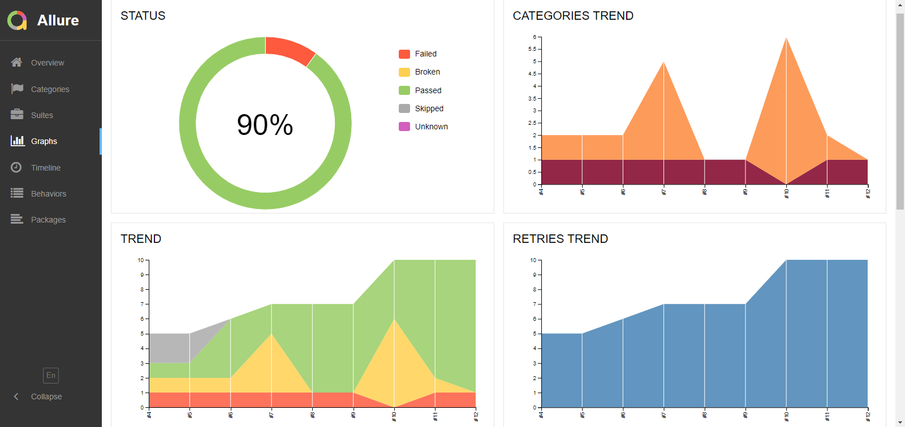

# Проект по автоматизации тестирования для Protei

## :pushpin: Содержание:

- [Технологии и инструменты](#earth_africa-технологии-и-инструменты)
- [Реализованные проверки](#earth_africa-Реализованные-проверки)
- [Сборка в Jenkins](#earth_africa-Jenkins-job)
- [Запуск из терминала](#earth_africa-Запуск-тестов-из-терминала)
- [Allure отчет](#earth_africa-Allure-отчет)

## :rocket: Технологии и инструменты

<p align="center">
<a href="https://www.jetbrains.com/idea/"></a>
<a href="https://www.java.com/"></a>
<a href="https://github.com/"></a>
<a href="https://junit.org/junit5/"></a>
<a href="https://gradle.org/"></a>
<a href="https://selenide.org/"></a>
<a href="https://github.com/allure-framework/allure2"></a>
<a href="https://www.jenkins.io/"></a>
</p>

## :scroll: Реализованные проверки

- ✓ Проверка успешной авторизации первой страницы.
- ✓ Проверка авторизации с неправильным email.
- ✓ Проверка авторизации с неправильным паролем.
- ✓ Проверка авторизации с отсутствующем email.
- ✓ Проверка авторизации с отсутствующим password.
- ✓ Проверка успешной отправки второй анкеты с мужским полом.
- ✓ Проверка успешной отправки второй анкеты с женским полом.
- ✓ Проверка второй анкеты с неправильной почтой.
- ✓ Проверка второй анкеты с неправильным паролем.
- ✓ Проверка отправки второй анкеты с пустыми полями.

## </a> Jenkins job
<a target="_blank" href="https://jenkins.autotests.cloud/job/berezkindv_performance_lab_complete_project/">Сборка в Jenkins</a>
<p align="center">
<a href="https://jenkins.autotests.cloud/job/berezkindv_performance_lab_complete_project/"></a>
</p>

### Параметры сборки в Jenkins:

- browser (браузер, по умолчанию chrome)
- browserVersion (версия браузера, по умолчанию 91.0)
- browserSize (размер окна браузера, по умолчанию 1920x1080)
- browserMobileView (название мобильного устройства, для примера iPhone X)
- threads (количество потоков)

## :computer: Запуск тестов из терминала

Локальный запуск:
```bash
gradle clean test
```

Удаленный запуск:
```bash
clean
test
-Dbrowser=${BROWSER}
-DbrowserVersion=${BROWSER_VERSION}
-DbrowserSize=${BROWSER_SIZE}
-DbrowserMobileView="${BROWSER_MOBILE}"
-Dthreads=${THREADS}
```

## </a> Отчет в <a target="_blank" href="https://jenkins.autotests.cloud/job/berezkindv_performance_lab_complete_project/22/allure/">Allure report</a>

### Основное окно

<p align="center">

</p>

### Тесты

<p align="center">

</p>

### Графики

<p align="center">

</p>

## </a>Интеграция с <a target="_blank" href="https://allure.autotests.cloud/launch/10223">Allure TestOps</a>
